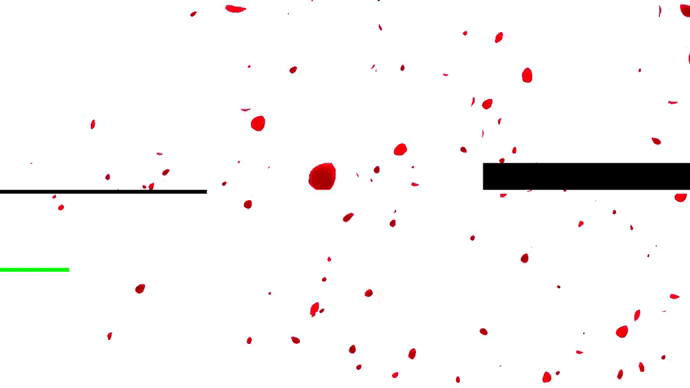

 
 <h2 align="center">MarriotZ's GitHub</h2>

    <a href="/docs/readme_chs.md">简体中文</a>
    ·
    <a href="/docs/readme_cht.md">繁体中文</a>
    ·
    <a href="/docs/readme_en.md">English</a>
    ·
    <a href="/docs/readme_jp.md">日本語</a>

<!-- Social icons section -->

  
  &#8287;&#8287;&#8287;&#8287;&#8287;
  

 

## Hi 伙计, 欢迎来到我的GitHub 😊

目前我主要承担后端开发工作

喜欢利用平时空余时间来撰写博客，同时也原意将一些所做项目进行开源。

另外，我也是一名美、英剧爱好者，欢迎大家推荐给我好看的剧目

## 🛠️ 我的技术栈

### 👨‍💻 编程和标记语言

    
    
    
    
    
    
    
    

### 🧰 框架和开源库

    
    

### 🗄️ 数据库和云空间

    
    
    

### 💻 软件和工具

    
    
    
    
    
    

## 🔭 

## 📫 联系方式:

- **Wechat** : Zeng-zihan
- **E-mail** : zihantsang@hotmail.com

## 🏠 个人博客:

- **[CSDN博客](https://blog.csdn.net/weixin_42839065)**

<!-- ## 📊 统计数据:

|  |  |
| ----------------------------------------------------------------------------------------------------------------------------------------------- | --------------------------------------------------------------------------------------------------------------------------------------------------------- |
-->

<!--
**MarriotZ/MarriotZ** is a ✨ _special_ ✨ repository because its `README.md` (this file) appears on your GitHub profile.

Here are some ideas to get you started:

- 🔭 I’m currently working on ...
- 🌱 I’m currently learning ...
- 👯 I’m looking to collaborate on ...
- 🤔 I’m looking for help with ...
- 💬 Ask me about ...
- 📫 How to reach me: ...
- 😄 Pronouns: ...
- ⚡ Fun fact: ...
-->
